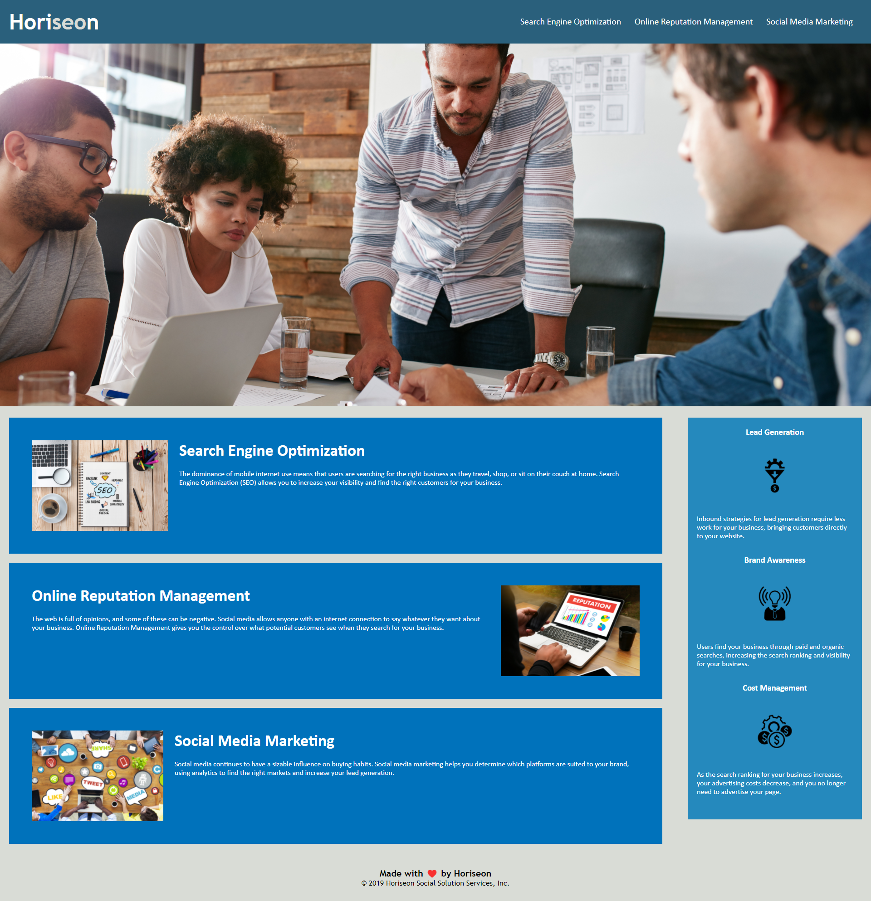

# HTML CSS Git Challenge: Code Refactor
[](https://bootcamp.msu.edu/)

## Technologies


## Description
Our task for the Challenge is for us to modify code that was given to us. We must take the existing code and refactor it so that it will meet a set of standards or to implement new technology. The challenge focused on the aspect of web developement accessibility. The acceptance criteria were as followed.

## User Story
```
AS A marketing agency
I WANT a codebase that follows accessibility standards
SO THAT our own site is optimized for search engines
```

## Acceptance Criteria
```
GIVEN a webpage meets accessibility standards
WHEN I view the source code
THEN I find semantic HTML elements
WHEN I view the structure of the HTML elements
THEN I find that the elements follow a logical structure independent of styling and positioning
WHEN I view the image elements
THEN I find accessible alt attributes
WHEN I view the heading attributes
THEN they fall in sequential order
WHEN I view the title element
THEN I find a concise, descriptive title
```

## Screenshot
Here is a preview of the website provide. 

## Link
A link to the code is provided below: [Code](https://github.com/jgarcia45/code-refactor-challenge)
```
https://github.com/jgarcia45/code-refactor-challenge
```
A link to the deployed live URL: [URL](https://jgarcia45.github.io/code-refactor-challenge/)
```
https://jgarcia45.github.io/code-refactor-challenge/
```